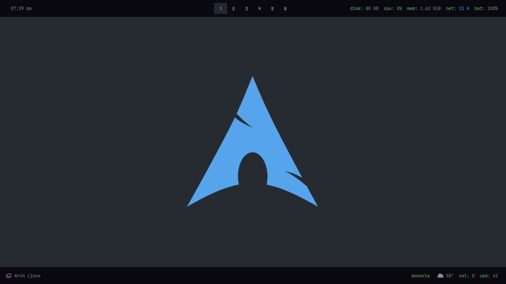

# edwark43 dotfiles:


## Setup:
The installer only works for **ARCH** Linux based distros that use systemd.

<b>Open a terminal in HOME</b>
- **First download the installer**
```sh
curl -L https://is.gd/lkarch -o $HOME/setup.sh
```
- **Now give it execute permissions**
```sh
chmod +x setup.sh
```
- **Finally run the installer**
```sh
./setup.sh
```
## Credits
- [gh0stzk/dotfiles](https://github.com/gh0stzk/dotfiles) - The repo this was originally forked from
- [Narmis-E/onedark-wallpapers](https://github.com/Narmis-E/onedark-wallpapers) - Wallpapers
- [rxyhn/tokyo](https://github.com/rxyhn/tokyo) - Brightness Script
